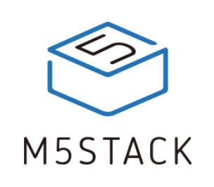

# M5Stack

[M5Stack](https://m5stack.com/about-us) ist ein Technologieunternehmen, das Open-Source-Entwicklungstoolkits entwickelt und herstellt, einschliesslich Hardware, Programmierplattform und IoT-Lösungen. Es wurde 2017 von Jimmy Lai gegründet und hat seinen Sitz in Shenzhen, China.

Die Firma hat die Mission "Schnelle und einfache IoT-Entwicklung", mit der M5STACK-Hardware-Middleware-Plattform und dem Ökosystem werden IoT-Entwicklung und -Bereitstellung einfacher und schneller.




Offizielles M5Stack Forum

