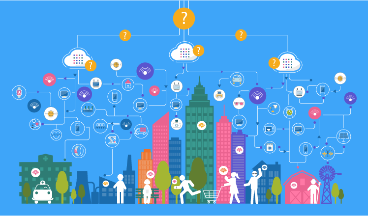

# IoE - Das Netz von Allem



Das **I**nternet **o**f **E**verything IoE (dt. Internet von Allem), wird durch die Vernetzung von Personen, Prozessen, Daten und Dinge gebildet. Der Vorteil des IoE ist der, dass es **Menschen**, **Geräte**, \*Appliances, **Prozesse**, **Daten** und Sachen miteinander zu einem intelligenten Prozess verbindet. Der Zusammenhang darin besteht, dass beim IoE fast alles online und über das Internet miteinander verbunden ist und dass die Bereitstellung der Daten in Echtzeit erfolgt.

Beim IoE sind nicht nur Computer, Laptops, Tablets und Smartphones miteinander verbunden, wie beim klassischen Internet, sondern auch intelligente Maschinen, die auf einen Datenbestand zugreifen und erweiterte Vernetzungsdienste nutzen können. Daher reichen die Einsatzmöglichkeiten für IoE-Netze von Sensornetzwerken und elektronischen Geräten sowie Geräten der Unterhaltungselektronik und der Wellnessindustrie über Einrichtungen einer Smart City, über die Einbindung von Kraftfahrzeugen und Verkehrseinrichtungen bis hin zu Industriemaschinen und verteilter, intelligenter Hardware. Solche Konstellationen bieten bisher einen nicht gekannten hohen Vernetzungsgrad zwischen Personen, Prozessen und Dingen.

\*(Appliances = kombiniertes System aus Computer-Hardware und speziell auf diese Hardware optimierter Software, z.B. Haushaltsgeräte)

### Die Säulen von IoE

Die Idee, Dinge zu verbinden, ist nicht neu. Tatsächlich ist das Internet der Dinge (IoT) ein Begriff das wird seit Ende der 1990er Jahre weitgehend akzeptiert. Das IoT bezieht sich auf das Netzwerk von physische Objekte, die über das Internet zugänglich sind.

Nicht alle Objekte, die mit dem IoT verbunden sind, werden Computergeräte sein, aber viele werden es sein. Also, was ist ein Computergerät? Es kann zwar leicht sein, einen Desktop oder Laptop zu identifizieren Computer kann die Grenze zwischen dem, was ein Computer ist und was nicht ist, verschwimmen. Ist ein Auto a Computergerät? Wie wäre es mit einer Uhr oder einem Fernseher?

Die ersten Rechengeräte (Computer) waren riesige, raumgrosse Maschinen, die Teams von Menschen aufzubauen, zu verwalten und zu pflegen. Heute sind sie exponentiell schneller und nur einen Bruchteil der Größe ihrer Vorgänger. Für die Zwecke dieses Kurses a Computergerät ist eine elektronische Maschine, die Berechnungen basierend auf einer Reihe von Anweisungen und besteht aus drei Hauptkomponenten: einer zentralen Verarbeitungseinheit (CPU), Speicher und eine Eingabe-/Ausgabeeinheit.

Basierend auf der obigen Definition ist eine Digitaluhr ein Computergerät, aber ein analoges Uhr nicht. Die Digitaluhr hat eine CPU, um ihr Programm auszuführen, sie hat einen Speicher zum Speichern der Programm- und andere Informationen, und verfügt über ein E/A-Gerät, um eine Benutzerinteraktion zu ermöglichen (Bildschirm, Display, Tasten, Tonsignale usw.). Obwohl die analoge Uhr über die I/O-Komponente verfügt, es fehlt CPU und Speicher.

### Was sind Dinge (Geräte)?

Derzeit umfasst die hervorgehobene Säule der Dinge verschiedene Arten von traditionellen Computer und Computergeräte wie Desktops, Laptops, Smartphones, Tablets, Grossrechner und Computercluster. Das IoT wird jedoch alle Arten von Objekten umfassen, einschliesslich Objekte und Geräte, die nicht traditionell verbunden sind. Man schätzt das tatsächlich einmal 99 Prozent der physischen Objekte eines Tages verbunden sein werden.&#x20;

Diese Objekte enthalten eingebettete Technologie zur Interaktion mit internen Servern und den Aussenumgebung. Diese Objekte sind netzwerkfähig und können über eine sichere, zuverlässige und verfügbare Netzwerkplattform. Das IoT bezieht sich jedoch auf eine einzelne Technologieübergang; die Fähigkeit, Objekte zu verbinden, die zuvor nicht verbunden waren, also diese Objekte können über das Netzwerk kommunizieren.

Die Verfügbarkeit von Daten, wenn Objekte erfassen und kommunizieren können, hat die Fähigkeit, ändern, wie und wo Entscheidungen getroffen werden, wer die Entscheidungen trifft und die Prozesse, die Einzelpersonen und Unternehmen verwenden, um diese Entscheidungen zu treffen. Das IoE ist gebaut über die Verbindungen zwischen Menschen, Prozessen, Daten und Dingen. Das sind die vier Säulen des IoE, wie in der Abbildung gezeigt. Beim IoE geht es jedoch nicht um diese vier Dimensionen in Isolation. Jeder verstärkt die Fähigkeiten der anderen drei. Es befindet sich im Schnittpunkt aller diese Elemente, dass die wahre Macht des IoE realisiert.

Laut [Internet World Stats](https://www.internetworldstats.com) (Stand Juni 2012) zeigen statistische Daten, dass es rund 2,4 Milliarden Nutzer im Internet gab. Das waren nur 34 % der gesamten Welt Population. **Die Zahl der mit dem Internet verbundenen Geräte überstieg 2012 die der Weltbevölkerung**. Dazu gehören traditionelle Computergeräte und mobile Geräte sowie neue industrielle und Verbrauchergeräte, die wir als „Dinge“ betrachten. Obwohl dies wie viele Geräte im Internet erscheinen mag, macht es weniger als 1% der aus die Objekte, die verbunden werden könnten.

#### Wie sieht es heute aus?

Man rechnet heute mit über 50 Milliarden "Dinge" im Internet und geht von einer Weltbevölkerung von 7.9 Milliarden Menschen aus und etwa 5.1 Milliarden Menschen, welche das Internet nutzen. Dies ist erst der Anfang.

### Was sind Daten?

Daten sind ein Schlüsselelement aller Computersysteme – von frühen Computersystemen bis hin zu aktuellen Systemen. Ein vorherrschender Grund für die Verwendung von Computersystemen war die Verarbeitung und Übertragung von Daten.

Daten sind ein Wert, der allem, was uns umgibt, zugewiesen wird. Daten sind überall. Jedoch von selbst können Daten ziemlich bedeutungslos sein. Wie wir die Daten interpretieren, zum Beispiel durch korrelieren oder vergleichen, wird es nützlicher. Diese nützlichen Daten sind jetzt Informationen. Wie diese Informationen angewendet oder verstanden werden, werden diese dann zu Wissen.

Typischerweise werden Daten als Informationen betrachtet, die im Laufe der Zeit gesammelt wurden. Es sind zum Beispiel verschiedene Transaktionen erhoben worden, für die Auftragsabwicklung. Diese Daten haben einen Wert für die Organisation und sind historischer Natur. Dies sind statische Daten, die wir 'data at rest' nennen.

Da jedoch das beschleunigte Wachstum grosser Datenmengen anhält, wird ein Grossteil davon ungenutz bleiben. Der Wert von Daten geht fast so schnell verloren, wie sie erzeugt werden. Geräte, Sensoren und Video liefern diese ständig wachsende Quelle neuer Daten. Diese Daten bieten maximalen Wert während es in Echtzeit interagiert. Wir nennen dies „Daten in Bewegung“.

Dieser Zustrom neuer Datenmöglichkeiten bietet neue Wege zur Verbesserung unserer Welt, von Lösung globaler Gesundheitsprobleme und zur Verbesserung der Bildung. Es gibt unglaubliches Potenzial für intelligente Lösungen, um Daten zu sammeln, zu verwalten und auszuwerten der menschlichen Kommunikationen. Infolgedessen wird es immer mehr um das Internet von allem gehen „Daten in Bewegung“.

#### Berbeiten von Big Data

Ein treibender Faktor für dieses Informationswachstum ist die Anzahl der Geräte, die mit dem Internet und die Anzahl der Verbindungen zwischen diesen Geräten. Aber das ist nur der Anfang. Täglich werden neue Geräte mit dem Internet verbunden, wodurch eine Fülle entsteht von neuen Inhalten.&#x20;

Mit dieser Menge an Informationen müssen Unternehmen lernen, Daten zu verwalten und auch, wie man „Big Data“ verwaltet.

Es gibt drei Hauptdimensionen von Big Data, die berücksichtigt werden müssen: **Volumen**, **Vielfalt** und **Geschwindigkeit**.&#x20;

Volume beschreibt die Datenmenge, die transportiert und gespeichert wird. Vielfalt beschreibt die Datentyp ist. Die Geschwindigkeit beschreibt die Geschwindigkeit, mit der sich diese Daten bewegen. Daten können nicht ohne Infrastruktur umziehen. Die Schnelligkeit der Infrastruktur (Input/Output, Bandbreite und Latenz) und die Möglichkeit, schnell optimale Ressourcen (Netzwerk, CPU, Arbeitsspeicher und Speicher) wirkt sich direkt auf die Geschwindigkeit der Daten aus.

### Menschen

Die Realität ist, dass wir alle miteinander verbunden sind (ob es euch gefällt oder nicht).

Daten allein dienen keinem Zweck. Eine grosse Datenmenge, auf die niemand zugreifen kann, dient niemanden. Die Organisation dieser Daten und deren Umwandlung in nutzbare Informationen ermöglicht es den Menschen, fundiertere Entscheidungen zu treffen und geeignete Massnahmen zu ergreifen. Das schafft wirtschaftliche Wert in einer Wirtschaft, die durch das Internet von allem ermöglicht wird.

Deshalb ist der Mensch eine der vier Säulen. Menschen sind eine zentrale Figur jedes Wirtschaftsystems. Menschen interagieren als Produzenten und Konsumenten, wenn es darum geht, das Wohlbefinden zu verbessern durch Befriedigung menschlicher Bedürfnisse. Ob die Verbindungen von Mensch zu Mensch (**P2P**) sind, Maschine-zu-Mensch (**M2P**) oder Maschine-zu-Maschine (**M2M**), alle Verbindungen und die Daten die aus diesen Verbindungen generiert werden, werden verwendet, um den Wert für die Menschen zu steigern.&#x20;

Das Internet wimmelt von Daten. Zugriff auf die Daten haben und dann Massnahmen ergreifen auf dem Wissen, das aus diesen Informationen gewonnen wird, ist das IoE.&#x20;

Zum Beispiel, Als Jack Andraka ein 15-jähriger Gymnasiast war, griff er auf Informationen zu im Internet, um einen Test zu entwickeln, der Bauchspeicheldrüsenkrebs in einem viel früheren Stadium erkennen könnte, wenn die Überlebenschancen deutlich besser sind.&#x20;

Was würden Sie tun, um Ihre Welt zu einem besseren Ort zu machen?

#### Informationen verändern Verhalten

Der Wert ist ein Mass für den Nutzen in einem Wirtschaftssystem. Es sind die Menschen, die den Wert bestimmen von Angeboten durch ein Austauschsystem. Es ist wichtig hervorzuheben, dass Daten und Analytik wichtig sind, es ist das Urteil von Menschen, das Daten in Erkenntnisse verwandelt und Erkenntnisse in IoE-Werte. Das IoE ermöglicht genaue und zeitnahe Informationen, die dazu führen können, dass sich der Mensch verändert im Verhalten zum Wohle aller Menschen.

### Prozesse

Die vierte Säule ist der Prozess. Prozesse spielen eine wichtige Rolle dabei, wie die anderen Säulen von Dinge, Daten und Menschen zusammenarbeiten, um einen Mehrwert in der vernetzten Welt zu schaffen von IoE. Das Internet hat die Art und Weise, wie Unternehmen ihre Lieferketten verwalten, in Art und Weise revolutioniert wie Verbraucher einkaufen. Bald werden wir Einblicke in Prozesse haben, die wir nie sehen konnten zuvor. Dies bietet Möglichkeiten, diese Interaktionen schneller und einfacher zu gestalten. Mit dem richtigen Prozess werden Verbindungen relevant zu Mehrwert, weil die richtigen Informationen, der richtigen Person zur richtigen Zeit in geeigneter Weise zugestellt werden. Prozesse erleichtern die Interaktion zwischen Menschen, Dingen und Daten. Das IoE bringt sie heute alle zusammen durch die Kombination von Maschine-zu-Maschine (M2M), Maschine-zu-Mensch (M2P) und People-to-People (P2P)-Verbindungen.

