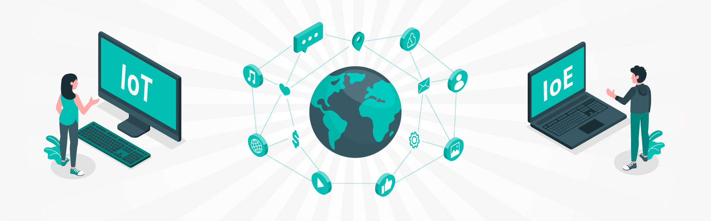

# IoE vs. IoT

Beim IoT (Internet of Things) werden Gegenstände intelligent gemacht, das heisst durch Logiken und Netzwerkfunktionalität wird es diesen ermöglicht mit anderen Geräten Informationen auszutauschen.

Beim IoE (Internet of Everything) werden die intelligenten **Dinge **mit **Prozessen**, **Daten **und **Menschen** verknüpft, welches zu einer zunehmenden Automatisierung der Wirtschaft führt und verstärkt Auswirkungen auf die Gesellschaft hat, Stichwort „**Big Data**”.

Während das IoT einen einheitlichen technologischen Übergang bildet, umfasst das IoE verschiedene Technologien, einschliesslich der IoT-Technologie und diverser Kommunikationsverbindungen. Der klassische Ansatz der Host-basierten Kommunikation wird beim IoE durch die inhaltsbasierte Kommunikation abgelöst. Bei dieser Netzarchitektur geht es um den qualifizierten Informationsgehalt, um dessen Kennzeichnung, Weiterleitung und Speicherung.
