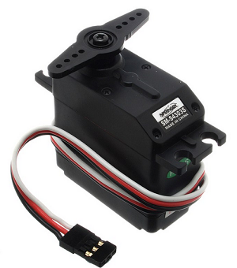

# Aktoren

Aktoren sind **Antriebselemente**, die elektrische Signale und Strom in **mechanische Bewegung** oder Licht transformieren. Sie stellen das Gegenteil zu Sensoren dar, die auf mechanische Bewegung mit elektrischen Impulsen reagieren. Diese Technologie ist aus dem Alltag kaum mehr wegzudenken und wird in den vielfältigsten Bereichen angewendet.

Nutzung von Aktoren

Sie werden in sogenannten smarten Systemen, wie beispielsweise in intelligenten Haussteuerungen, genutzt. Mit dieser Technologie ist es möglich, Komponenten wie Rollläden oder Heizungen per Smartphone zu steuern. In diversen Elektrobauteilen wie Lampen oder Lautsprechern sind sie ebenso unverzichtbar wie in Druckern, Messgeräten oder Laufwerken. Ohne diese Technik gäbe es keine Computer, denn die benötigten Festplatten sind ebenfalls mit einem Aktorenantrieb ausgestattet. Da diese Antriebe heute praktisch in fast allen Bereichen zur Anwendung kommen, sind sie ein fester Bestandteil der modernen Technik und ein entsprechend interessantes Gebiet ingenieurwissenschaftlicher Forschung geworden.

Der Klassiker ist der Elektromotor, ein Servo im Modellbau oder die höherwertigen Schrittmotoren.

Aktoren benötigen meist noch eine Steuereinheit, welche die Ströme und Kräfte gezielt ansteuern kann.

