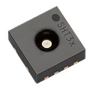

# Sensoren

Ein Sensor (von lateinisch sentire, dt. „fühlen“ oder „empfinden“), auch als Detektor, (Messgrössen- oder Mess-)Aufnehmer oder (Mess-)Fühler bezeichnet, ist ein technisches Bauteil, das bestimmte physikalische oder chemische Eigenschaften (physikalisch z. B. Wärmemenge, Temperatur, Feuchtigkeit, Druck, Schallfeldgrößen, Helligkeit, Beschleunigung oder chemisch z. B. pH-Wert, Ionenstärke, elektrochemisches Potential) und/oder die stoffliche Beschaffenheit seiner Umgebung qualitativ oder als Messgröße quantitativ erfassen kann. Diese Grössen werden mittels physikalischer, chemischer oder biologischer Effekte erfasst und in ein weiterverarbeitbares elektrisches Signal umgeformt. So steht es auf Wikipedia :lab\_coat:

Ein Sensor kann also je nach Beschaffenheit ganz unterschiedliche Werte "fühlen"

Tauscht euch untereinander aus und untersucht mal, was eurer Smartphone alles für Sensoren hat. Ihr werdet staunen.

Jeder Sensor hat entsprechend ein Datenblatt in welchem seine Spezifikationen beschrieben sind, was für Daten er messen kann und wie er angesteuert, bzw. in Betrieb genommen wird.

Aus dem Datenblatt könnt ihr entnehmen das beim ENV-III ein **SHT30** und ein **QMP6988** verwendet werden.

### Aufgabe

Sucht im Internet nach diesen beiden Sensoren und schaut mal was ihr herausfinden könnt.

* Wer stellt diesen Sensor her? (Hersteller)
* Was kostet dieser auf dem Markt?
* Gibt es ein Datenblatt?
* Was für Parameter gelten? (Grenzwerte, Tolleranzen, Anschlussmöglichkeiten etc.)

