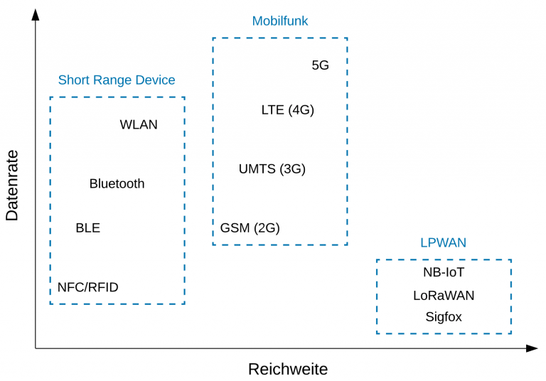

# Funktechnologien und deren Einsatzgebiet

Durch die Nutzung von Funktechnologien entfällt bei den IoT-Sensoren der Kosten- und Zeitaufwand für die Verkabelung und die IoT-Sensoren können an Standorten ohne Zugang zum Stromnetz verbaut und über eine Batterie mit Strom versorgt werden. Die IoT-Sensoren übertragen in regelmässigen oder unregelmässigen zeitlichen Abständen kleine Datenpakete. Dadurch können Funktechnologien genutzt werden, die eine geringe Datenrate aufweisen und keine dauerhafte Funkverbindung aufbauen. Ausserdem muss die zur Datenübertragung genutzte Funktechnologie einen geringen Energieverbrauch aufweisen, damit die batteriebetriebenen IoT-Sensoren eine möglichst lange Batterielaufzeit haben. Besonders wenn die verbauten IoT-Sensoren sich über eine grosse Fläche erstrecken, muss die Funktechnologie eine hohe Reichweite haben, damit eine gute Netzabdeckung mit einem vertretbaren Aufwand zu realisieren ist. Darüber hinaus muss die genutzte Funktechnologie eine starke Durchdringung von Objekten aufweisen, damit IoT-Sensoren, die in Gebäuden oder unter der Erde verbaut sind, auch zuverlässig Datenpakete übertragen können.

Bei IoT-Lösungen im Consumer-Bereich werden meistens Funktechnologien, wie z.B. WLAN, Bluetooth oder ZigBee eingesetzt (Short Range Device). Diese Funktechnologien haben einen geringen Energieverbrauch, aber auch nur eine geringe Reichweite von bis zu 100 Metern. Für industrielle IoT-Lösungen wird noch häufig der klassische Mobilfunk (GSM, UMTS, LTE) als Funktechnologie genutzt. Allerdings hat diese Funktechnologie einen hohen Energieverbrauch und ist mit hohen Anschaffungs- und Betriebskosten verbunden.

&#x20;Daher haben sich mittlerweile für IoT-Lösungen Funktechnologien etabliert, die aus dem Bereich der **L**ow **P**ower **W**ide **A**rea **N**etwork (LPWAN) stammen. LPWAN-Funktechnologien zeichnen sich durch geringe Anschaffungs- und Betriebskosten aus, haben einen geringen Energieverbrauch, eine gute Durchdringung von Objekten und können Datenpakete mit einer geringen Datenraten über mehrere Kilometer übertragen. Durch die relativ hohe Latenz bei der Datenübertragung sollten LPWAN-Funktechnologien allerdings nicht für zeitkritische Anwendungen genutzt werden.

Die bekanntesten LPWAN-Funktechnologien sind [LoRaWAN](lora-lorawan/), Sigfox und [NB-IoT](narrowband-iot.md). Diese Funktechnologien haben unterschiedliche Eigenschaften und sind daher für unterschiedliche Anwendungen geeignet. Während NB-IoT auf dem klassischen Mobilfunk aufbaut und von einem Mobilfunk-Provider bereitgestellt wird, kann mit LoRaWAN ein privates Netzwerk aufgebaut werden. Dadurch kann die Netzabdeckung standortspezifisch ausgebaut werden und es besteht keine Abhängigkeit von einem Provider. Sigfox wird über den gleichnamigen Provider bereitgestellt und eignet sich für Anwendungen, wo nur wenige und kleine Datenpaket übertragen werden müssen.

In der angefügten Datei seht ihr eine übersicht&#x20;




Die Frequenz bezeichnet die Anzahl der Schwingungen je Sekunde, die bei einem Ton oder Signal vorhanden sind. Je schneller die Teilchen schwingen, desto höher wird die Frequenz. Die Einheit ist Hertz (Hz)

