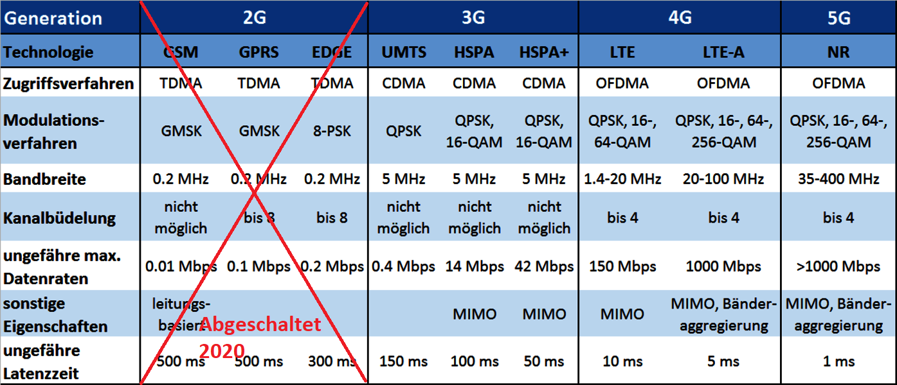

# GSM / GPRS / UMTS / LTE / 3G / 4G / 5G

Die Bezeichnungen in der Titelleiste stehen alle für verschiedene Mobile Kommunikationsarten. Die meisten von euch verwenden heute 4G oder 5G.

Die angefügte Grafik soll einen kleinen Überblick verschaffen.

Wir verzichten auf weitere technische Details einzugehen. 5G wird aber IoE noch verstärkt antreiben.

„Global System for Mobile Communication“ [https://www.informationszentrum-mobilfunk.de/technik/funktionsweise/gsm](https://www.informationszentrum-mobilfunk.de/technik/funktionsweise/gsm)
