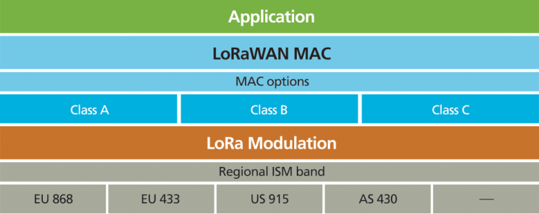
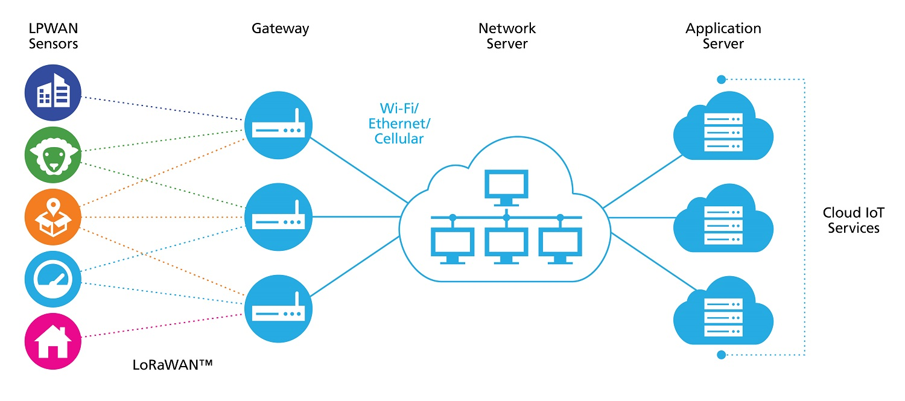

# LoRa - LoRaWAN

**L**ong **R**ange **W**ide **A**rea **N**etwork (LoRaWAN) ist ein Low-Power-Wireless-Netzprotokoll auf der Ebene der Vermittlungsschicht (engl. network layer). Die LoRaWAN-Spezifikationen werden von der LoRa Alliance festgelegt. Sie sind frei verfügbar und Software-Grundmodule sind als Open-Source-Software verfügbar. LoRaWAN nutzt das proprietäre, patentierte, leitungslose „LoRa“-Übertragungsverfahren auf der Bitübertragungsschicht (engl. physical layer).

Es baut auf dem Übertragungsverfahren LoRa auf, dass die Chirp Spread Spectrum Modulationstechnik nutzt. Auf das Übertragungsverfahren LoRa wird das Protokoll LoRaWAN gesetzt, dass den Netzwerkaufbau und die Kommunikation der einzelnen Netzwerkelemente beschreibt.

Die LPWAN-Funktechnologie LoRaWAN ist von der LoRa Alliance spezifiziert, die unter anderem von den Firmen IBM, Cisco und Semtech gegründet wurde. In Europa wird mit LoRaWAN das ISM-Band im 868 MHz Frequenzbereich mit acht Kanälen und einer Bandbreite von 125 kHz genutzt. Damit sich die Kommunikationspartner in umfangreichen LoRaWAN-Netzwerken nicht gegenseitig stören, werden die Datenpakete pseudozufällig auf unterschiedlichen Kanälen gesendet.

Die Architektur von einem LoRaWAN-Netzwerk ist als Sterntopologie angeordnet. Dabei senden Endgeräte ihre Datenpakete über ein Gateway an den Netzwerkserver. Anschliessend werden die Daten an den Anwendungsserver weitergeleitet. LoRaWAN ermöglicht eine bidirektionale Kommunikation, bei der Datenpakete vom Endgerät zum Anwendungsserver übermittelt werden (Uplink) oder vom Anwendungsserver zum Endgerät (Downlink).

Mit LoRaWAN können private Netzwerke aufgebaut werden. Hierbei liegt die Verantwortung für den Aufbau und Betrieb der Gateways beim Anwender. Dadurch besteht keine Abhängigkeit von kommerziellen Anbietern, wie bei NB-IoT und Sigfox, und Standorte ohne LoRaWAN-Abdeckung können durch die Installation eines Gateways ausgeleuchtet werden. Eine weitere Möglichkeit sind die kostenfreie und Community-basierten LoRaWAN-Netzwerke, wie z.B. The Things Network.

Der Netzwerkserver und Anwendungsserver können vom Anwender betrieben werden oder es können die Dienst von Anbietern wie The Thing Network oder Loriot genutzt werden.
