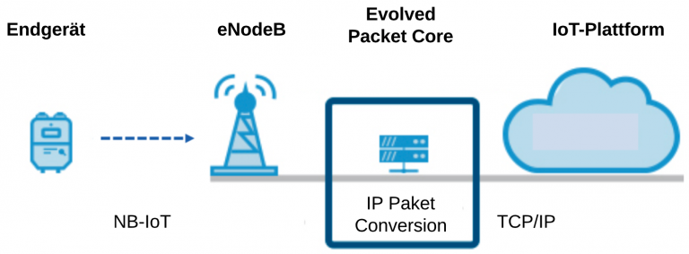

# Narrowband-IoT

**N**arrow**b**and-**IoT **(**NB-IoT**) ist eine Erweiterung zum LTE-Mobilfunkstandard und wird von Telekommunikationsanbietern bereitgestellt. Die Anwender können NB-IoT durch die Zahlung einer Gebühr nutzen, um Datenpakete zu übertragen.

Die bestehende LTE-Infrastruktur unterstützt hardwareseitig Narrowband-IoT. Daher genügt es in den meisten Fällen, wenn der Mobilfunkanbieter eine Softwareaktualisierung für die bestehende Mobilfunkinfrastruktur durchführt, um NB-IoT bereitzustellen. Dadurch kann (theoretisch) vom Mobilfunkanbieter zeitnah eine flächendeckende Versorgung mit NB-IoT umgesetzt werden, während bei Funktechnologien wie Sigfox, die Infrastruktur erst aufgebaut werden muss.

Mit der LPWAN-Funktechnologie NB-IoT können Daten mit einem deutlich geringeren Energieverbrauch gesendet werden, als mit LTE. Ausserdem sind die NB- IoT-Funkmodule deutlich preiswerter als LTE-Funkmodule. NB-IoT sendet im lizensierten LTE-Frequenzspektrum von 450 bis 2200 MHz mit einer Kanalbreite von 200 kHz. Regional werden unterschiedliche Frequenzbänder genutzt. In Europa werden die NB-IoT-Bänder B3 (1800 MHz), B8 (900 MHz) und B20 (800 MHz) genutzt. Mit den niedrigen Frequenzbändern B8 und B20 wird eine gute Gebäudedurchdringung und hohe Reichweite durch die langwelligen Funksignale erreicht, während mit dem Band B3 eine hohe Datenrate (bis zu 200 kBit/s) erreicht wird. Im Gegensatz zu LoRaWAN und Sigfox im ISM-Band, gibt es im lizensierten Frequenzband keinen Duty-Cycle, der die Sendezeit beschränkt. Dadurch können beliebig oft Datenpakete übertragen werden und bei Funkstörungen können Datenpakete wiederholt gesendet werden. Ausserdem sind die lizensierten Frequenzbänder für eine hohe Anzahl an Endgeräten ausgelegt und können einen stabilen und störungsfreien Betrieb gewährleisten, der im lizenzfreien Frequenzband durch Interferenzen nicht immer gegeben ist.

Ein Endgerät ist mit einer SIM-Karte von einem Telekommunikationsanbieter ausgestattet, z.B. Swisscom oder Sunrise (UPC). Das Endgerät sendet Datenpakete an einen eNodeB (Uplink) oder empfängt Datenpakete von einem eNodeB (Downlink). Ein Evolved Node B (eNodeB) ist Bestandteil der herkömmlichen Mobilfunkinfrastruktur und leitet die empfangenen Datenpakete an das Kernnetz Evolved Packet Core weiter. Hier werden der Betrieb und die Koordination im Funknetzwerk ermöglicht und Mobilität, Handover und Roaming zwischen den Teilnehmern des Funknetzwerks gewährleistet. Anschliessend werden die Datenpaket an die IoT-Plattform des jeweiligen Anbieter weitergeleitet. In Deutschland sind das die Firmen Telekom mit „Cloud der Dinge“ und Vodafone mit „Vodafone IoT Platform“. Auf der IoT-Plattform werden die Daten der Endgeräte gespeichert und Schnittstellen bereitgestellt, um die Daten weiterzuleiten. Zusätzlich können bei den IoT-Plattformen die Daten visualisiert und analysiert werden.

NB-IoT verfügt über umfangreiche Sicherheitsmechanismen. Auf der SIM-Karte sind vertrauliche Anmeldeinformationen gespeichert, mit denen das Endgerät sich im Mobilfunknetzwerk anmelden und seine Identität bestätigen kann (Authentizität). Ausserdem werden die gesendeten Datenpakete verschlüsselt, um ein nicht-autorisiertes Auslesen und Manipulieren der Daten zu verhindern (Integrität). Allerdings ist der Energieverbrauch des Endgeräts durch das Verschlüsseln der Daten höher und die Batterielaufzeit dadurch geringer. Die Firmware eines Endgeräts kann per NB-IoT aktualisiert werden, um veraltete Firmware zu aktualisieren und Sicherheitslücken zu schliessen.
