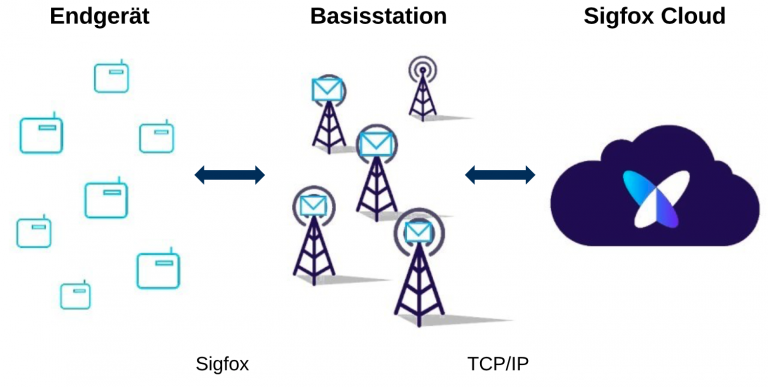

# Sigfox

Der Anbieter [Sigfox](https://www.sigfox.com/en) betreibt ein gleichnamiges, proprietäres Funknetzwerk, das Anwender gegen eine Gebühr nutzen können, um kleine Datenpakete zu übertragen.

Die LPWAN-Funktechnologie Sigfox sendet im lizenzfreien ISM-Band mit 868 MHz (Europa) und nutzt dabei für die Modulation die Ultraschmalbandtechnologie mit Binary Phase Shift Keying. Insgesamt nutzt Sigfox eine Kanalbreite von 192 kHz mit einer Bandbreite pro Datenpaket von nur 100 Hz. Dadurch können Kollisionen unter den gesendeten Datenpaketen praktisch ausgeschlossen werden. Durch die verwendete Modulationstechnik kann Sigfox Daten über eine grosse Reichweite (bis 40 km in ländlichen Gebieten) senden und hat eine gute Gebäudedurchdringung. Dabei verbraucht Sigfox nur wenig Energie, was in einer lange Batterielaufzeit der Endgeräte resultiert.

Wegen den regulatorischen Beschränkungen im ISM-Band können mit Sigfox pro Tag maximal 140 Datenpakete übertragen werden und ein Datenpaket kann maximal 12 Byte gross sein. Durch diese Einschränkungen eignet sich Sigfox für Anwendungen, die in grossen Zeitintervallen (grösser 10 Minuten) Datenpakete senden und nur kleine Datenpakete übertragen müssen. Ausserdem kann durch die geringe Datenrate keine Firmware-Aktualisierung (FOTA) über Sigfox durchgeführt werden, wie es bei LoRaWAN und NB-IoT möglich ist.

Bei Sigfox können die Endgeräte bidirektional kommunizieren, also Datenpakete an die Basisstation senden (Uplink) oder Datenpakete von einer Basisstation empfangen (Downlink). Die Basisstation wird von der Firma Sigfox oder deren Partnern aufgebaut und betrieben. Dadurch hat der Anwender keinen Einfluss auf die Sigfox-Abdeckung an seinem Standort. Die Abdeckung mit dem Sigfox-Funknetzwerk ist bisher nur in Deutschland, Frankreich, Irland, Dänemark und den Benelux-Ländern weitgehend flächendeckend ausgebaut. Zusätzlich plant Sigfox den Ausbau auf dem amerikanischen Kontinent, Australien, Teilen Afrikas, sowie Nord- und Osteuropa. Die Datenpakete werden von der Basisstation an die Sigfox Cloud gesendet. In der Sigfox Cloud werden die Authentizität und Integrität der Datenübertragung sichergestellt. Ausserdem werden die empfangenen Daten in ein lesbares Format umgewandelt und in einer Datenbank in der Sigfox Cloud gespeichert. Es werden Schnittstellen (z.B. MQTT, HTTP) bereitgestellt, um die Daten weiterzuleiten.

Ein Endgerät besitzt einen einzigartigen Schlüssel, mit dem es sich gegenüber der Sigfox Cloud authentifizieren kann und die Integrität des gesendeten Datenpakets gewährleistet wird. Die Datenpakete werden mit Sigfox standardmässig nicht-verschlüsselt übertragen. Bei kritischen Anwendungen, die eine Verschlüsselung benötigen, kann die Verschlüsselungslösung von Sigfox genutzt werden. Um Replay-Angriffe zu verhindern, wird ein Zähler zwischen dem Endgerät und der Sigfox Cloud hochgezählt. Dadurch kann erkannt werden, wenn ein Datenpaket von Dritten abgefangen und erneut gesendet wird.
