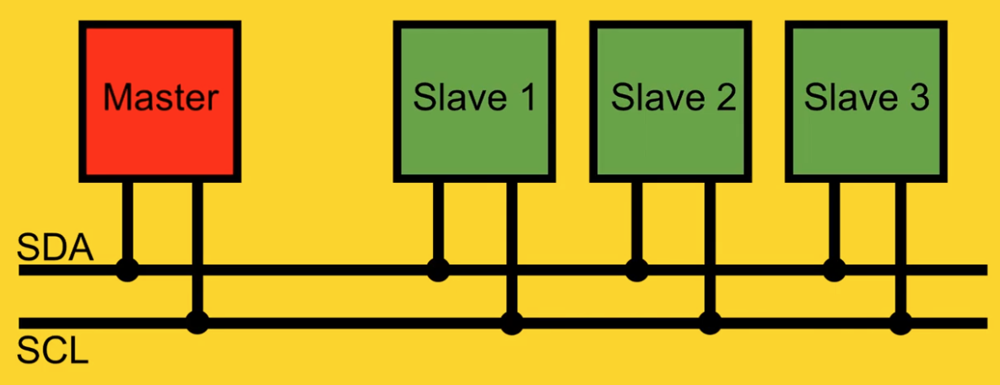

# I²C - Inter-Integrated Circuit

Der I²C-Bus ist als Zweidrahtverbindung zwischen einem Master (Controller) und an ihn angeschlossene Sensoren oder IC-Bausteine (Slaves) für kurze Distanzen konzipiert worden. Nur der Master steuert die Verbindung zwischen ihm und den Slaves.

An einer Kommunikation können auch mehrere Master und bis zu 128 Slaves beteiligt sein. Die beiden dazu notwendigen Datenleitungen, neben den Versorgungsspannungsleitungen, bezeichnen wir mit SDA (Datenleitung) und SCL (Taktleitung); SDA und SCL bilden den Datenbus.

SDA (**S**erial **D**ata **L**ine: serielle Datenleitung) und SCL (**S**erial **C**lock **L**ine: serielle Taktleitung)

[http://fmh-studios.de/theorie/informationstechnik/i2c-bus/](http://fmh-studios.de/theorie/informationstechnik/i2c-bus/)

