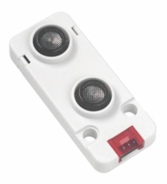

# ⚗ Labor Tag3

Wir starten heute zu einem gemeinsamen Vorprojekt als Vorbereitung zu eurem Projekt, welches ihr am 4. Tag in 2er Gruppen starten werdet.

Es besteht folgendes Szenario:

Die Firma Spectre AG hat ihre Arbeitsplätze am Hauptsitz stark reduziert und es stehen nur noch beschränkt Arbeitsplätze zur Verfügung. Damit Mitarbeiter nicht unnötig vom Homeoffice ins Büro kommen und dann keinen Arbeitsplatz vorfinden, soll auf einem Dashboard angezeigt werden, welcher Platz frei oder belegt ist. Ihr bekommt dazu von eurem Instruktor den Sensor "Ultrasonic".

Los geht's. Das Ziel ist es das **Alle** mitmachen und ihren Beitrag leisten.

### Heute habt ihr folgende Aufgaben:

* [ ] Koordiniert euch untereinander. Wer macht was.
* [ ] Euer Instruktor gibt euch ein Login für IO.Adafruit um das zentrale Dashboard zu erstellen.
* [ ] Jeder Arbeitsplatz wird vernetzt!
* [ ] Ihr müsst die entsprechende Feeds erstellen für eure Sensoren. Achtung, setzt den Verbindungsinterwall auf 60 Sekunden, damit die Leitung nicht gesperrt wird zum MQTT-Broker.
* [ ] Wählt eine passende Anzeige auf dem M5Stack.
* [ ] Erstellt eine Interaktion, damit eine anwesende Person nicht den Arbeitsplatz verliert, wenn diese in die Pause geht. Auch dies soll auf dem Dashboard angezeigt werden.
* [ ] Erstellt eine technische Zeichnung, welche den Verbindungsweg und Datenwege aufzeigt.
* [ ] Wie könnte ein Sicherheitskonzept aussehen?
* [ ] Erstellt ein Testkonzept mit entsprechenden Testings.
* [ ] Alles Fertig? Gibt es weitere Features die genutzt werden könnte? Mach dich schlau.
