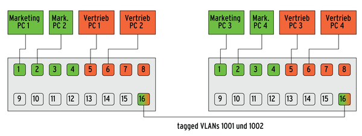

# Netzwerk

Ihr habt im Kapitel Security gelesen, wie wichtig es ist die Netze zu trennen und voneinander zu schützen, doch wie geht das? Wir verzichten hier auf eine detaillierte technische Vertiefung was den Rahmen sprengen würde.

### Segmentierung der Netzwerke

In dem man Netzwerke voneinander trennt. Die IoT Device sollen in einem eigenen WLAN operieren und keinen Zugriff auf andere Netzwerke haben.

Eine Segmentierung lässt sich auch mit VLANs durchführen. Dazu werden auf Ports von Switch die entsprechenden VLANs zugewiesen.

VLANs (**V**irtual **L**ocal **A**rea **N**etworks) unterteilen ein bestehendes einzelnes physisches Netzwerk in mehrere logische Netzwerke. Jedes VLAN bildet dabei eine eigene Broadcast-Domain. Eine Kommunikation zwischen zwei unterschiedlichen VLANs ist nur über einen Router möglich, der an beide VLANs angeschlossen ist.

### Firewall

Die Firewall ist so das Herzstück eines Netzwerkes. Eine Firewall ist ein Sicherungssystem, das ein Rechnernetz oder einen einzelnen Computer vor unerwünschten Netzwerkzugriffen schützt. Weiter gefasst ist eine Firewall auch ein Teilaspekt eines Sicherheitskonzepts.

Heutige Firewall sind heute auch gleich der Router des Netzwerkes. Über Policys  und Richtlinien kann der Netzverkehr stark limitiert und eingeengt werden. So ist es möglich den Zugriff über Devices (MAC-Adresse oder IP-Adresse), sowie Gruppierungen und Ports oder Applikationen zu steuern. Dies kommt ganz auf deren Aufbau und Funktionsumfang an.

Es gibt Firewalls ab 100 Fr. bis zu mehreren 10'000 Fr.

